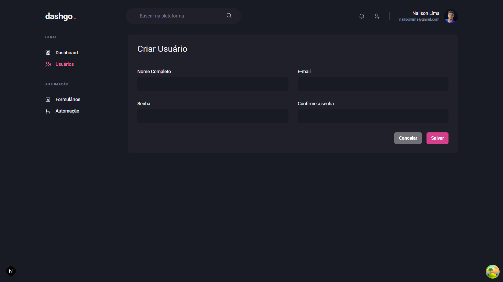
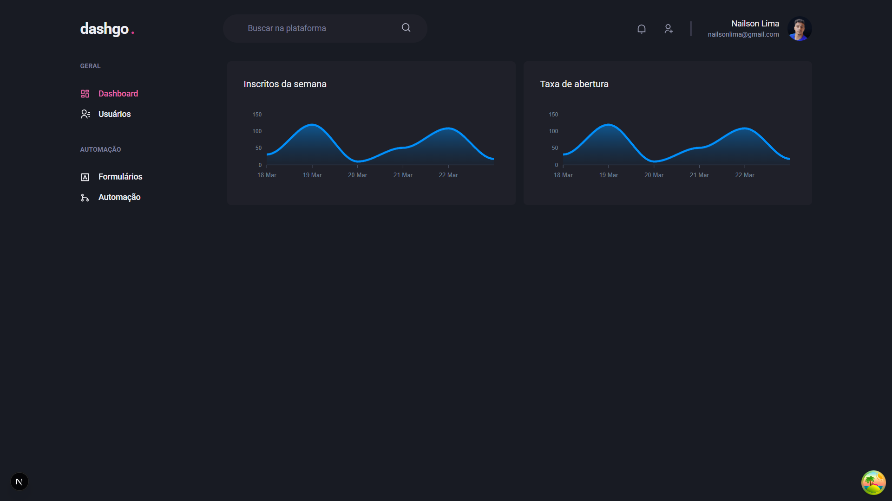
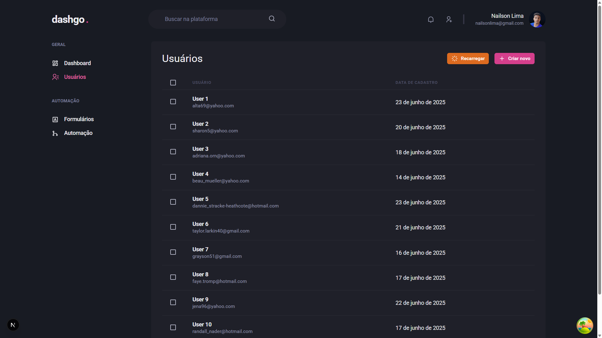

# 🚀 Dashgo - Dashboard Administrativo
Dashboard moderno feito com Next.js, React Query, Chakra UI e MirageJS para mockar API.
Projeto focado em gestão de usuários com paginação, pré-carregamento de dados e autenticação simulada.
Ideal para aprender front-end avançado e boas práticas em TypeScript.

🛠️ Tecnologias
Next.js

React Query

Chakra UI

MirageJS

TypeScript

🧠 Funcionalidades

-Listagem paginada de usuários
-Prefetch de dados para otimização
-Criação de usuários via formulário
-Dashboard responsivo
-Simulação de autenticação com contexto
-Validação de formulários

📸 Telas do projeto
<p>🔸 Criar novo usuário</p>  <p>🔸 Dashboard geral</p>  <p>🔸 Lista de usuários</p> 

```
⚙️ Como rodar localmente
# Clone o repositório
git clone https://github.com/seu-usuario/dashgo.git

# Entre na pasta do projeto
cd dashgo

# Instale as dependências
npm install

# Rode o servidor de desenvolvimento
npm run dev

# Acesse no navegador
http://localhost:3000
```


Sinta-se à vontade para usar, melhorar ou sugerir algo.

Contribuições são muito bem-vindas! 🚀

👨‍💻 Desenvolvido por Nailson Lima
